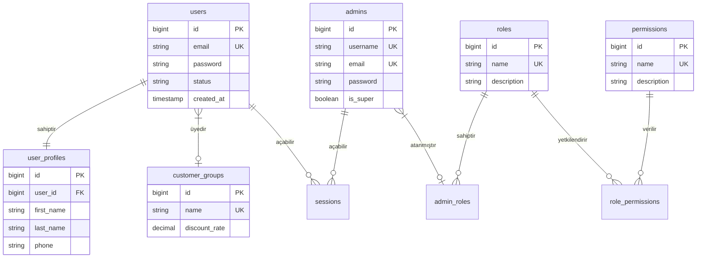
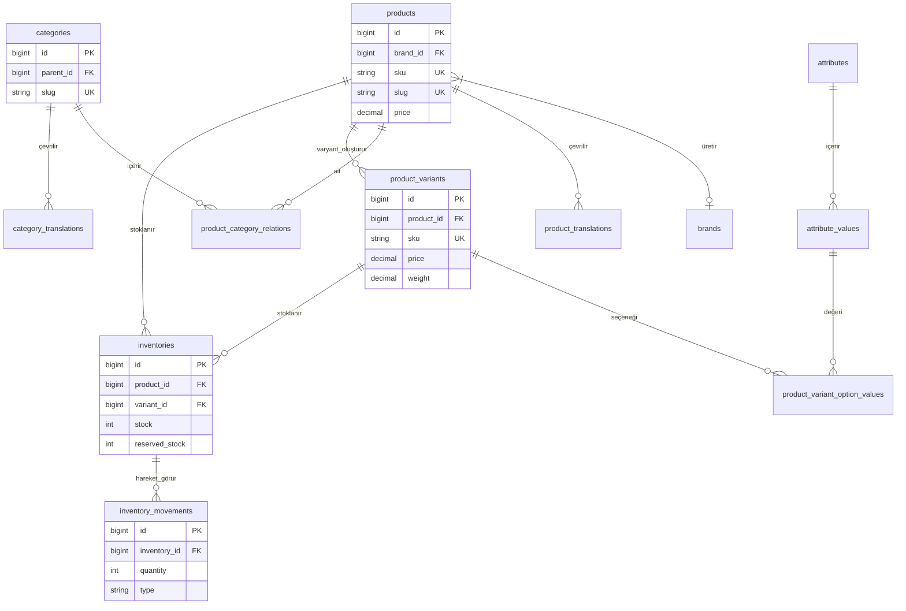
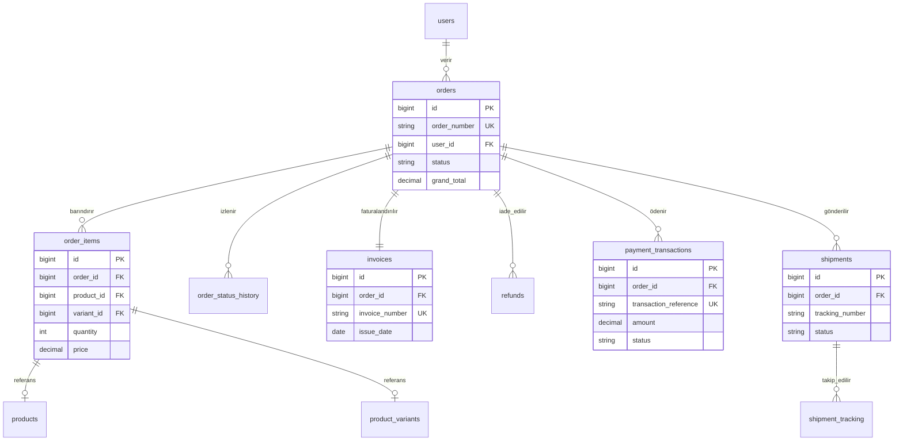
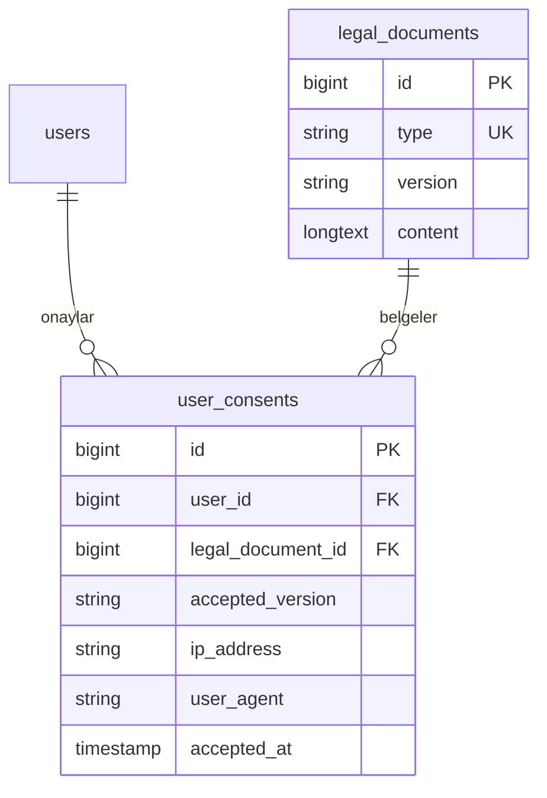

# SaintMonarc Varlık İlişki Diyagramı (ERD)

Bu belge, SaintMonarc e-ticaret platformunun veritabanı şemasını görselleştiren Mermaid.js diyagramlarını içermektedir. Büyük şemayı daha anlaşılır kılmak için mantıksal modüllere bölünmüştür.

## 1. Çekirdek ve Kullanıcı Yönetimi (Core & Users)

## 2. Ürün ve Envanter Yönetimi (Products & Inventory)

## 3. Sipariş ve Satış Yönetimi (Shopping & Orders)

## 4. Yasal Uyum ve KVKK (Legal Compliance)

